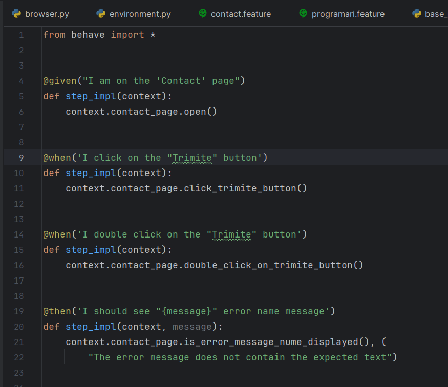
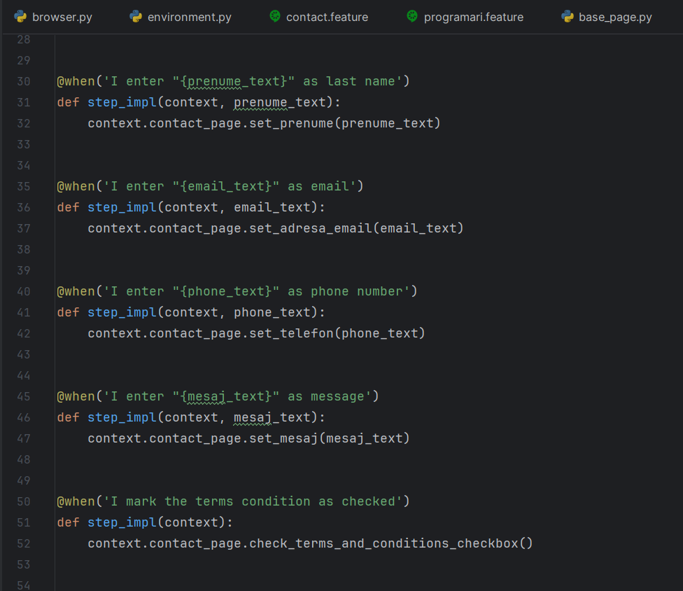
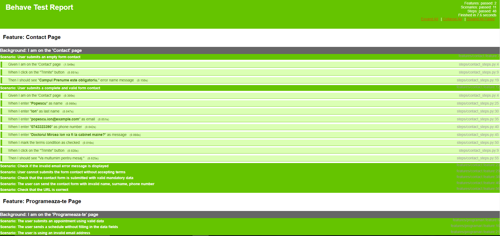

# BDD_Automated_Test_Project

### TESTED APPLICATION

https://teodent.ro/

I chose to check the website of the Teodent dental clinic. The evaluation of the "Contact" and "Programeaza-te" pages was my main concern. To make sure that all these functions work properly, we checked functionalities such as: sending messages or successful schedules, validating error messages, using an invalid email address, etc.

### LANGUAGE, IDE, BOOKSTORES
I chose to perform the testing using the Python programming language and the PyCharm IDE. I used the Selenium, webdriver-manager, behave and behave-html-formatter libraries to automate the interaction with the Teodent website. The "Python Packages" section of PyCharm can be accessed to install these libraries. After adding the name of the desired library in the field, I pressed the "Install" button.

### THE IMPORTANCE OF AUTOMATED TESTING
Efficiency in software development depends on automated testing. Speed, reproducibility, extended coverage, reusability, ease of integration with agile development practices and early detection of errors are the main benefits. This constantly helps to ensure the quality of the software.

### THE CHOSEN METHODOLOGY
The software development methodology called BDD (Behavior-Driven Development) focuses on the collaboration of team members and on describing the behavior of the application in a simple language, such as Gherkin. We chose BDD to facilitate communication between developers, testers and other interested parties and to create automated tests that reflect the behavior clearly specified by stakeholders. Benefits include: clear communication, easy-to-understand and up-to-date tests, and alignment between requirements and implementation. BDD encourages teamwork and guarantees that development focuses on developing useful functionalities that meet user expectations.

### DESIGN PATTERN 
I chose to organize the code of the automated tests using the "Page Object Model" (POM). Reusability, encapsulation, ease of maintenance, readability and resistance to change are some of its benefits. POM improves the development and maintenance of automated tests and code structure.

### USE OF THE PROJECT
Using the project starts by cloning it from GitHub. Access the project, press the green *"Code"* button, copy the link, navigate on the computer to the desired folder, open *Git Bash*, write the command *"git clone"* followed by the link and press *"Enter"*. The cloned project can be opened in PyCharm. To run tests, use the command *"behave -f html -o behave-report.html"* in the terminal. To view the generated report, open the *"behave-report.html"* file in Chrome.

### STRUCTURE OF THE PROJECT
The project has a structure consisting of a series of files and directories. We find settings for opening Chrome, maximizing the window and a default wait of three seconds in the "browser" file. We have the structure of the pages tested in the "environment". "features", "pages" and "steps" are the three directories that make up the general structure. The test scenarios are written in Gherkin syntax and can be found in the "features" category. We have general methods for actions such as clicking, finding the element, typing, etc. defined in "pages". The other files contain locators and specific methods for the suggested scenarios. The Gherkin syntax defines the functions of the "steps" directory. This structure organizes the code for automated tests.

### SCREENSHOTS WITH THE CODE

### SCENARIOS

Test scenarios chosen for evaluation include:

* Submitting an empty contact form
* Sending a complete and valid contact form
* Checking the invalid email error message
* Sending the contact form without accepting the terms
* Sending the contact form by filling in the mandatory fields
* Submitting the contact form with invalid name, surname, phone number
* Checking the correctness of the URL address
* Submitting an appointment using valid data
* Sending an appointment without filling in the given fields
* Using an invalid email address

These scenarios cover a variety of situations to ensure that the key functionalities of the application are tested exhaustively and that errors can be identified and handled accordingly.

