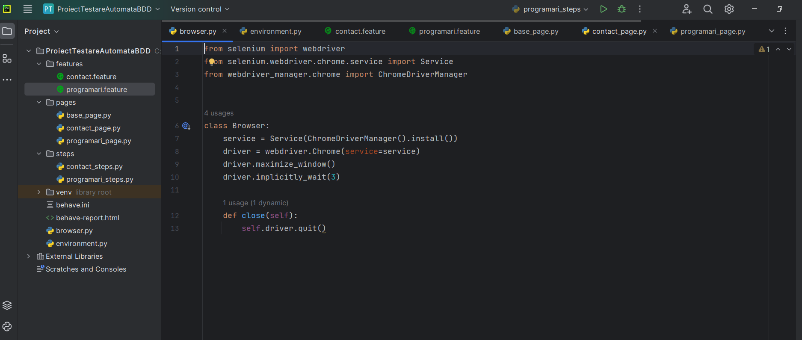
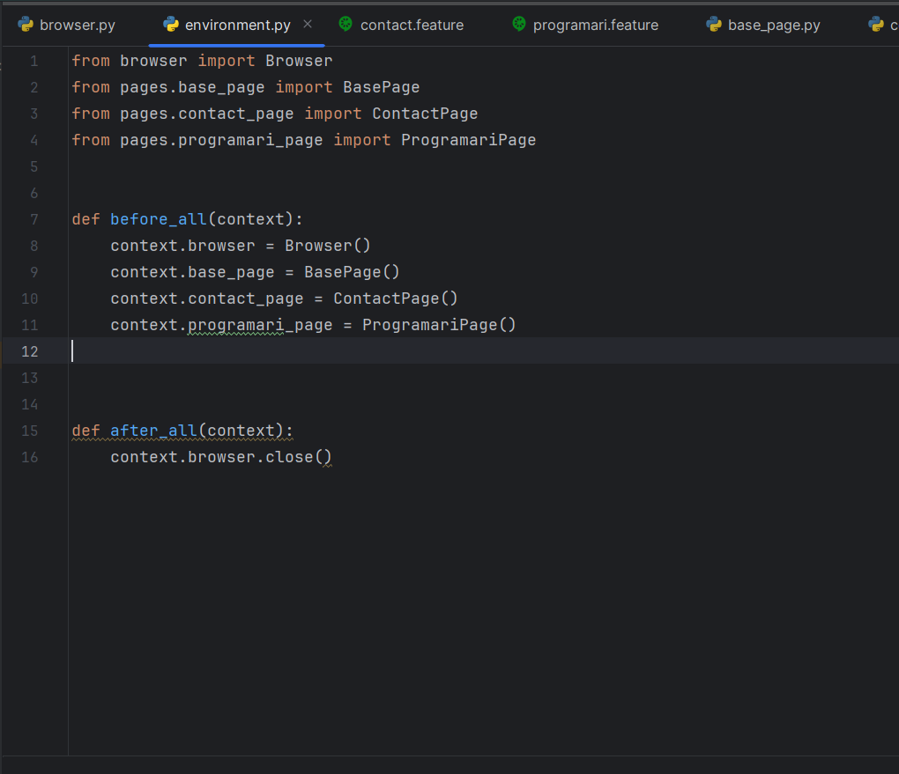
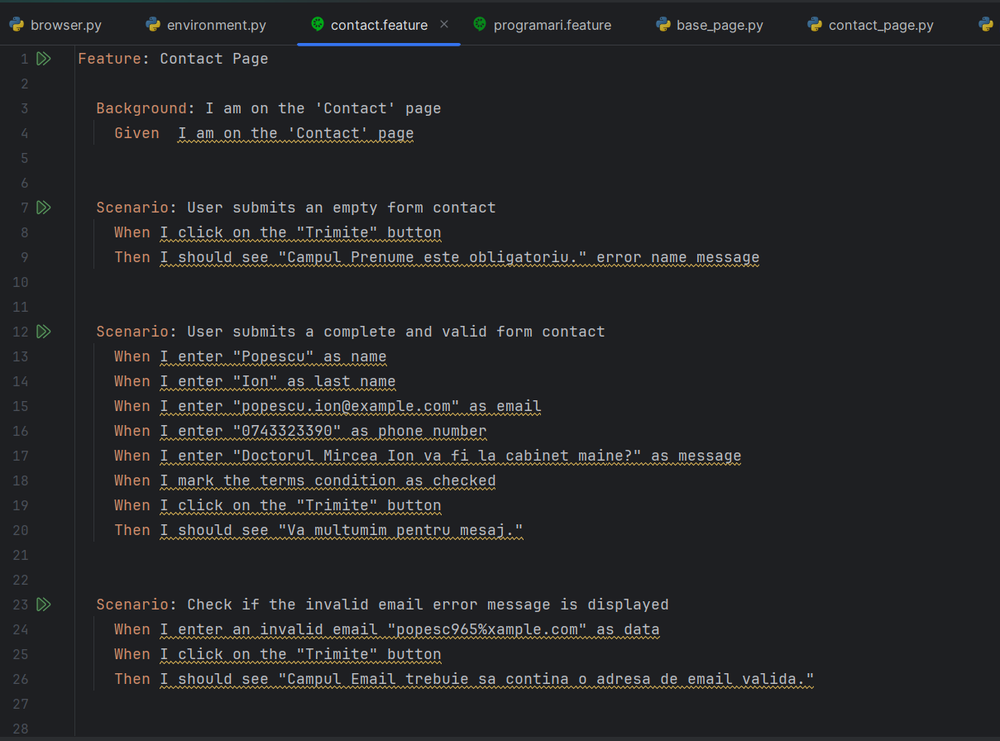
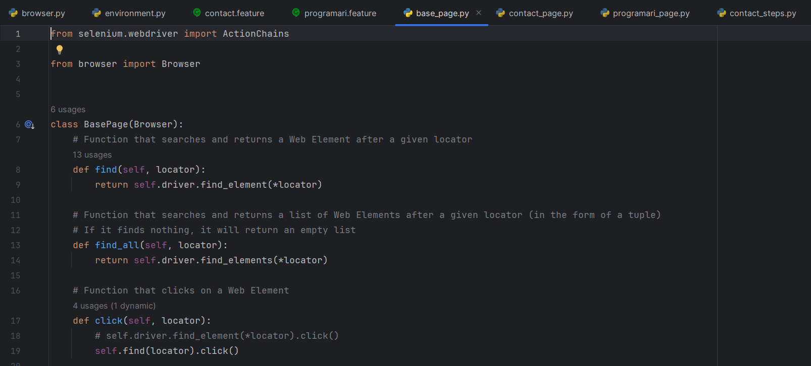
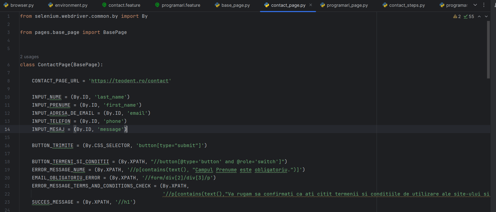
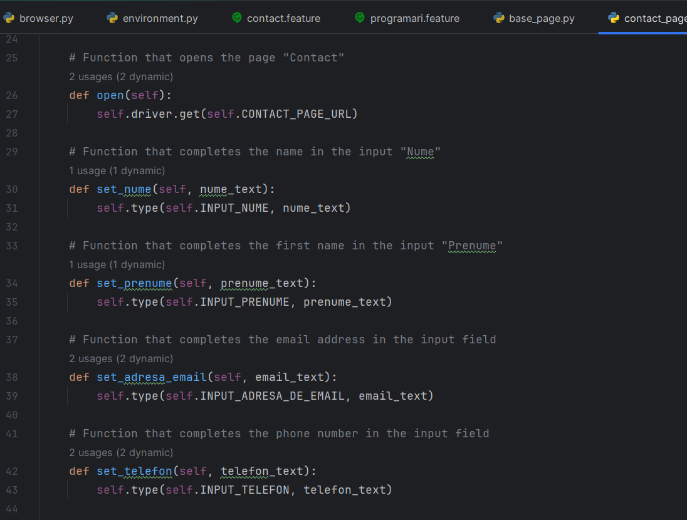

# BDD_Automated_Test_Project

### TESTED APPLICATION
I chose to check the website of the Teodent dental clinic. The evaluation of the "Contact" and "Programeaza-te" pages was my main concern. To make sure that all these functions work properly, we checked functionalities such as: sending messages or successful schedules, validating error messages, using an invalid email address, etc.

### LANGUAGE, IDE, BOOKSTORES
I chose to perform the testing using the Python programming language and the PyCharm IDE. I used the Selenium, webdriver-manager, behave and behave-html-formatter libraries to automate the interaction with the Teodent website. The "Python Packages" section of PyCharm can be accessed to install these libraries. After adding the name of the desired library in the field, I pressed the "Install" button.

### THE IMPORTANCE OF AUTOMATED TESTING
Efficiency in software development depends on automated testing. Speed, reproducibility, extended coverage, reusability, ease of integration with agile development practices and early detection of errors are the main benefits. This constantly helps to ensure the quality of the software.

### THE CHOSEN METHODOLOGY
Using the project starts by cloning it from GitHub. Access the project, press the green *"Code"* button, copy the link, navigate on the computer to the desired folder, open *Git Bash*, write the command *"git clone"* followed by the link and press *"Enter"*. The cloned project can be opened in PyCharm. To run tests, use the command *"behave -f html -o behave-report.html"* in the terminal. To view the generated report, open the *"behave-report.html"* file in Chrome.

### SCREENSHOTS WITH THE CODE

